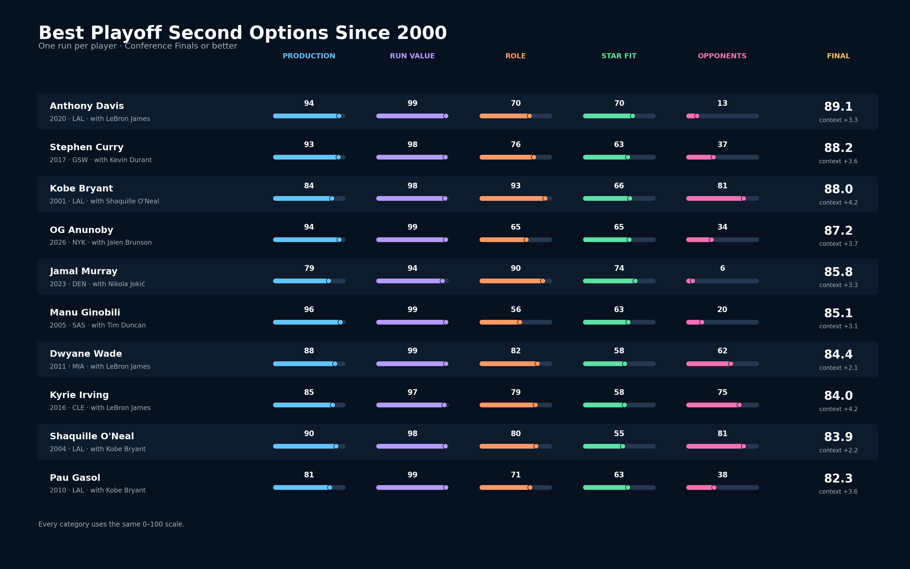
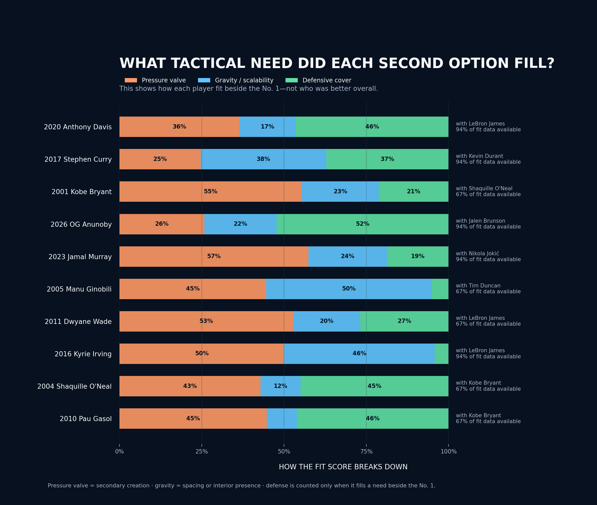
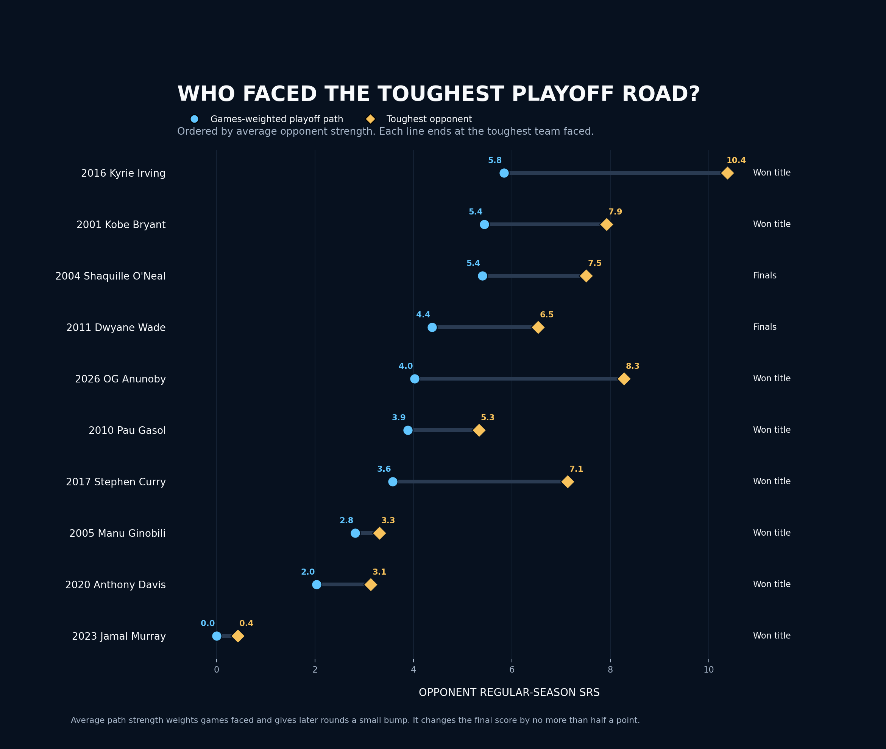

# NBA Playoff Second-Option Pipeline

[](https://www.python.org/)
[](https://github.com/ryanj06/nba-playoff-second-options/actions/workflows/ci.yml)
[](LICENSE)

My friends and I used to debate the best first options on championship teams. But
as roster construction became a bigger part of how we talked about the NBA, I
found myself more interested in the player next to the superstar.

A great second option can completely change what a team is capable of. Some take
over the offense when the No. 1 gets trapped. Some provide the spacing that opens
everything up. Others cover the team's biggest weakness on defense. That made me
wonder: who had the best single-playoff run as a No. 2 since 2000?

To answer it, I studied every team that reached at least the Conference Finals. I
assigned the roles based on how each team actually played—not simply who finished
second in scoring. Every #1/#2 pairing is available in the role audit so the
close calls and judgment decisions are easy to check.

Players needed at least eight playoff games, 15 minutes per game, and a meaningful
role in their team's final series to qualify.

## Where the ranking landed

**2020 Anthony Davis** finishes first. I limited the public list to one run per
player so it does not become three versions of the same star:

1. 2020 Anthony Davis
2. 2017 Stephen Curry
3. 2001 Kobe Bryant
4. 2026 OG Anunoby
5. 2023 Jamal Murray
6. 2005 Manu Ginobili
7. 2011 Dwyane Wade
8. 2016 Kyrie Irving
9. 2004 Shaquille O'Neal
10. 2010 Pau Gasol

The full data still keeps every qualifying run. The one-run limit only applies to
the graphic and top-ten list.



## What the charts show

The tactical-fit chart shows what kind of problem each player solved beside the
primary star. It separates secondary creation, scalable gravity, and
need-specific defensive cover. It is a breakdown of playing style, not another
ranking.



The opponent chart compares each player's full playoff path with the strongest
team he faced. Competition is part of the story, but it only has a small effect
on the final score.



The repo keeps the final analysis and leaves out draft charts, duplicate exports,
and local photo files.

## Project structure

```text
nba_second_options_single_season.py  # thin command-line entry point
nba_second_options/
  config.py       # configuration, statuses, and domain errors
  era.py          # season environments and rolling era normalization
  sources.py      # source adapters, retry behavior, and cache
  contextual_ingestion.py # resumable playoff play-by-play/rotation caching
  stints.py        # exact constant-lineup intervals and observed score changes
  metrics.py      # qualification and feature-engineering functions
  role_audit.py   # model proposals, reviewed decisions, and audit export
  contextual_value.py # validated role-matched replacement-value estimator
  contextual_spec.py  # locked NBA feature contract and missing-data rules
  sensitivity.py  # six-domain championship robustness simulation
  simple_scorecard.py # final four-part ranking, small context adjustments, weight tests
  visuals.py      # rights-safe LinkedIn and portfolio graphics
  pipeline.py     # season and full-history orchestration
  reporting.py    # charts, reports, tables, and run manifest
```

The download code and the ranking code are separate. That makes it easier to
check the math, swap in a better data source, or rerun the project from cache.

## Installation

Python 3.11+ is recommended.

```bash
python -m venv .venv
source .venv/bin/activate
pip install -e .
```

For an editable development install with tests and linting:

```bash
pip install -e ".[dev]"
pytest
ruff check .
```

## Run

From this directory:

```bash
python nba_second_options_single_season.py \
  --start-season 1999-00 \
  --output-dir analysis_outputs
```

To make sure the pipeline and charts work without downloading anything:

```bash
python nba_second_options_single_season.py --demo --output-dir demo_outputs
```

To rerun the analysis from an existing cache:

```bash
python nba_second_options_single_season.py \
  --offline \
  --cache-dir data/cache \
  --output-dir analysis_outputs
```

The game-level pull is much larger because it saves play-by-play and rotation
data for every playoff game. It is resumable, but I recommend trying one season
first and keeping the cache:

```bash
python nba_second_options_single_season.py \
  --start-season 2023-24 \
  --end-season 2023-24 \
  --cache-contextual-games \
  --cache-dir data/cache \
  --output-dir analysis_outputs
```

Use `--strict-metrics` if you only want scores with every required input. The
normal run keeps partial scores visible, labels them `PARTIAL`, and shows how
much of the underlying data was available.

## How the ranking works

The public ranking comes from a four-part scorecard. I keep the experimental
replacement-value work and the championship-only stress test separate so they
do not quietly change the main result.

The optional replacement-value model learns from earlier seasons and is checked
on later ones. It only gets used if it can beat a simple historical-average
baseline. For each comparison, the No. 1 and the team's needs stay fixed while
the No. 2 is swapped for a similar player from the same era and role.

The main result comes from the simpler scorecard. It combines playoff production
(43%), total value across the run (22%), role responsibility (15%), and fit with
the primary star (20%). A small adjustment accounts for how far the team went,
the strength of its opponents, and the player's performance in the final series.
I also rerun the model across thousands of alternative weights to see which
results hold up and which ones depend on a specific choice.

- **Who gets into the dataset:** Every Conference Finalist is included. A player
  needs at least eight playoff games, 15 MPG, and meaningful minutes in the
  team's final series.
- **How I assign the roles:** The first pass looks at scoring load, creation,
  the NBA's Player Impact Estimate (PIE), and minutes to find the player the
  offense ran through. The second pass looks for the next scoring and creation
  option. The role audit shows both the original model pick and any
  basketball-based correction.
- **TS%:** `PTS / (2 × (FGA + 0.44 × FTA))`.
- **BPM:** Canonical postseason BPM 2.0 scraped from Basketball-Reference. NBA
  raw plus-minus is never relabeled as BPM.
- **Stabilized 3PT%:** A beta-binomial estimate pulls tiny shooting samples
  toward that season's playoff average. High-volume shooters move much less.
- **Era adjustment:** Points per 75, TS%, usage, creation, and three-point volume
  are compared with playoff rotation players from the same period. Tracking
  stats use a nearby three-year window, weighted toward the current season.
- **Complete-run check:** The player must log 15+ MPG in at least half of the
  team's final-series games. That keeps an injury-shortened cameo from standing
  in for a full Conference Finals or Finals run.
- **Production:** A geometric mean of era-relative BPM, points per 75, and TS%.
  The geometric mean keeps one huge number from hiding a weak one.
- **Filling the star's gaps:** The No. 2's creation, gravity, and defensive value
  are matched with what the No. 1 needed most.
- **Doubling down on strengths:** Shared creation and gravity can make both stars
  harder to guard. Defensive overlap is not always a bonus; another rim
  protector may add less beside an elite defensive big.
- **Role-aware defense:** Defensive evidence is compared within broad position
  groups and nearby seasons before it enters the fit score.
- **Fit score:** Combines gap-filling with shared offensive strengths. Missing
  pieces are shown through coverage and `PARTIAL` labels.
- **Final score:** 43% rate performance, 22% cumulative run value
  from VORP and Win Shares (which already incorporate playing time),
  15% role responsibility, and 20% fit beside the primary star. Production
  remains the largest part. When fit data is missing, that portion moves toward
  a neutral 50 instead of being treated as zero.
- **Playoff context:** Conference Finals/Finals/title completion adds
  0/1.5/3.5 points; opponent-SRS path and deepest-round play each move a run by at
  most 0.5 point. Opponent SRS is weighted by games faced and a modest later-round
  multiplier. Context cannot replace the player's core performance.
- **Championship-only check:** I also test title runs across 50,000 different
  weight combinations. This shows which conclusions survive different ideas of
  value instead of pretending one split is unquestionably correct.
- **Defense:** There is no position-blind defensive bonus. BPM already carries
  some defensive information, and defense also helps the fit score when it
  answers a real need beside the star. DBPM, defensive Win Shares, steals, and
  blocks stay visible, but they do not get counted again as a separate vote.
- **Position-aware spacing:** Perimeter shooting is judged relative to position
  and shown beside interior gravity, so bigs are not graded like guards.
- **Lineup interaction:** I calculate both-stars, No. 1-only, No. 2-only, and
  neither lineups, but keep the result out of the ranking. It is too dependent
  on teammates and deployment to call causal.

## Where the data comes from

Most of the data comes from NBA Stats through `nba_api`. I use
Basketball-Reference for BPM, VORP, Win Shares, and team SRS. The downloads are
cached, along with the source and retrieval details, so the analysis can be
reproduced without hitting the same pages every time.

Some of the more detailed stats simply do not exist for older playoff runs. The
NBA's tracking era began in 2013-14, and even the early tracking seasons have
gaps in play-type, shot-clock, catch-and-shoot, and rim-defense data. When a
number is unavailable, I label it `NOT_MODELED`. I do not replace it with zero or
make up an estimate from an unrelated box-score stat.

## What the ranking can and cannot say

This is a structured comparison, not a claim that I isolated each player's
causal impact. Scores within a point or two are better read as the same tier.
Every role call is available in `analysis/role_pairing_audit.csv`, unavailable
tracking stays `NOT_MODELED`, and raw on/off never stands in for player value.
Player photos are not in the public repo because I do not own redistribution
rights. The `--demo` command uses fake data and is only there to test the code.
